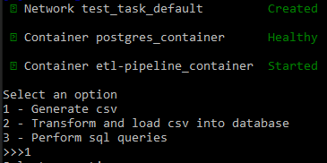
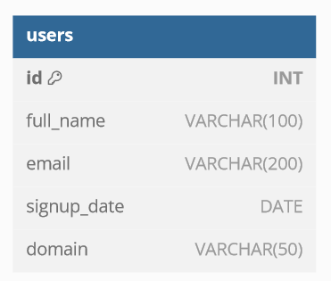

# Українська
## Як розпочати роботу
### Якщо ви збираєтесь контейнеризувати застосунок
1. Впевнитись, що у вас завантажено docker та працює коректно
2. Перейдіть до папки з файлом Dockerfile у командній строці
3. Вкажіть команду 
```docker build -t etl-pipeline .``` Цей код створить image застосунку з назвою etl-pipeline
4. Як тільки image буде створений можна створити контейнер застосунку. Так, як застосунок працює з користувачем через команду строку, 
вигляд команди буде трішки інший. Файл docker-compose.yml містить інформацію про контейнери які будуть створені. Один для
бази даних PostgresSQL, інша для Python застосунку. Застосунок запускається лише після того, як база дних буде доступна. Для створення контейнерів, впишіть команду 
```docker-compose up -d && docker attach etl-pipeline_container```, яка запустить створення контейнерів у фоновому процесі та виведе на екран роботу з Python застосунком. 
Коли все закінчиться ви побачите меню застосунку. Якщо воно не з'явилося, але etl-pipelin_container має статус Started, а postgres_container статус Healthy - напишіть будь яку комбінацію.\

5. Ви можете користуватись застосунком
### Якщо *ви* не збираєтесь контейнеризувати застосунок
1. У папці з проєктом створіть віртуальне середовище Python за допомогою команди 
```python -m venv venv```
2. Активуйте віртуальне середовище за допомогою команди 
```./venv/Scripts/activate```
3. Завантажте всі бібліотеки, що потребуються для роботи застосунки через команду 
```pip install -r requirements.txt```
4. У файлі config.ini змініть значення host на localhost
5. Якщо ви збираєтесь все одно використовувати PostgresSQL через Docker у файлі docker-compose.yml видаліть сторчку etl і все що нижче.
Також змініть змінну середовища DATABASE_HOST на localhost. Щоб запустити створення контейнеру, впишіть команду
```docker-compose up```
6. Як тільки ви побачите, що база даних доступна, запускайте застосунок.

Не забудьте у будь-якому варіанті використання закінчити роботу застосунку через команду
```docker-compose down```

## Як це працює (припущення)

### init
Так, як під час виконання тестового завдання я намагався використати якнайменше завантажених бібліотек, було вирішено використати формат .ini, а не змінні середовища. Це була помилка. Якщо треба щось змінити, це треба робити до створення Image.
* csv_file - адреса csv файлу, що буде використовуватись у пайплайні
* host - ip бази даних
* database - назва бази даних
* username - ім'я користувача бази даних
* password - пароль для користувача бази даних
* port - порт бази даних

### Меню
Застосунок включає невелике меню.
1. Генерує csv файл, якщо його не нема, або треба отримати новий набір даних
2. Виконує UTL Pipeline з 2-3 завдання
3. Виконує всі Queries та повертає результат, для того, щоб можна було швидко впевнитись в їх роботі

### Генерація csv
* Для генерації повного імені використовується два текстових файли з 100 іменами та 100 призвіщами. Їх комбінація дає 10000 варіантів, тому випадкова їх комбінація дає дуже малий шанс на повторення
* Для генерації дати реєстрації у форматі timestamp використовується генератор випадкового цілочисленого числа в проміжках 1710000000 та 1723660000. 
* Для генерації поштової адреси використовується два текстових файли з 10000 випадковими словами та 30 доменами, з яких 2 порушують синтаксис.
Випадковим чином обирається від 1 до 3 частин пошти. Після чого кожна частина теж генерується з певним шансом - 80% на слово з файлу,
19% на число, та 1% на точку, що дозволяє створювати некоретні поштові адреси для їх фільтрації. Далі з 50% шансом між частинами точка або ставиться, або ні

### Pipeline
Для роботи з csv використовується бібліотека pandas. Для валідації email використовується бібліотека email_validator. Спочатку була ідея використати regex, але
валідація потових скриньок вимагає включати велику кількість нюансів, а так як, це тестове завдання, використовувати чужі regex не культурно.\
Далі створюється таблиця, видаляються всі записи, якщо вони є, та записуються нові. Чомусь запис через docker контейнер postgresSQL набагато повільніший ніж, 
який завантажено у систему. Тому вставка значень може тривати 1.5 хвилини. Для того, щоб відслітковувати прогрес, використовується бібілотека tqdl. 

### База даних
Спочатку була ідея нормалізувати базу даних. Тобто привести повне ім'я до атомарних значень - ім'я та прізвище. Але так як це не впливає на задачу, і цього не було вказано у завданні, цією нормалізацією було припущено. 
Також правильно було б вивести доменне ім'я до іншої таблиці, і в таблиці users лише вказувати id домену. Але в завданні вказано an table, тобто лише одну таблицю, тому цю нормалізацію теж не було виконано.\
Таблиця має наступну схему\


### Queries
Всі SQL команди можна знайти у папці application/sql

# English
## Getting Started
### If you plan to containerize the application
1. Ensure that Docker is installed and working correctly.
2. Navigate to the folder with the Dockerfile in the command line.
3. Run the command
```docker build -t etl-pipeline .``` This command will create an image of the application named etl-pipeline
4.  Once the image is created, you can create the application container. Since the application interacts with the user through the command line, the command format is slightly different. The docker-compose.yml file contains information about the containers that will be created—one for the PostgresSQL database and another for the Python application. The application will only start after the database is available. To create the containers, enter the command 
```docker-compose up -d && docker attach etl-pipeline_container```. This will launch the containers in the background and display the interaction with the Python application. When everything is finished, you will see the application menu. If it does not appear, but etl-pipeline_container has the status Started and postgres_container has the status Healthy, press any key.\

5. You can now use the application.
### If you do *not* plan to containerize the application
1. In the project folder, create a Python virtual environment using the command
```python -m venv venv```
2. Activate the virtual environment using the command
```./venv/Scripts/activate```
3. Install all required libraries for the application using the command
```pip install -r requirements.txt```
4. In the config.ini file, change the host value to localhost.
5. If you still plan to use PostgresSQL via Docker, delete the etl section and everything below it in the docker-compose.yml file. Also, change the environment variable DATABASE_HOST to localhost. To launch the container, enter the command
```docker-compose up```
6. Once you see that the database is available, start the application.

Remember to shut down the application using the command
```docker-compose down```

## How It Works (Assumptions)

### init
Since I tried to use as few external libraries as possible during the test task, I decided to use the .ini format instead of environment variables. This was a mistake. If anything needs to be changed, it must be done before creating the image.

* csv_file - The path to the CSV file that will be used in the pipeline.
* host: - The database IP address.
* database - The name of the database.
* username - The database username.
* password - The password for the database user.
* port - The database port.

### Menu
The application includes a small menu:

* Generates a CSV file if it doesn't exist or if a new dataset is needed.
* Executes the UTL Pipeline from tasks 2-3.
* Runs all queries and returns the results to quickly verify their correctness.

### CSV Generation
* To generate full names, two text files with 100 first names and 100 last names are used. Their combination gives 10,000 variants, so the random combination gives a very small chance of repetition.
* To generate registration dates in timestamp format, a random integer generator is used within the ranges 1,710,000,000 to 1,723,660,000.
* To generate email addresses, two text files with 10,000 random words and 30 domains are used, two of which violate syntax. A random selection of 1 to 3 email parts is made. Each part is generated with a certain probability—80% for a word from the file, 19% for a number, and 1% for a dot, which allows for creating incorrect email addresses for filtering. There is a 50% chance that a dot will or will not be placed between parts.

### Pipeline
The pandas library is used to work with CSV files. The email_validator library is used for email validation. Initially, I considered using regex, but validating email addresses involves many nuances. Since this is a test task, using others' regex patterns didn't seem appropriate.
Next, a table is created, all records are deleted if they exist, and new records are inserted. For some reason, inserting values through the Docker PostgresSQL container is much slower than the one installed on the system. Therefore, the insertion process can take about 1.5 minutes. The tqdm library is used to track progress.

### Database
Initially, I planned to normalize the database, i.e., split full names into atomic values—first and last names. However, since this doesn't affect the task and wasn't mentioned in the requirements, this normalization was skipped.
It would also be correct to extract the domain name into a separate table and only indicate the domain ID in the users table. But since the task specifies "a table," meaning only one table, this normalization was also skipped.
The table has the following schema\


### Queries
All SQL commands can be found in the application/sql folder.
